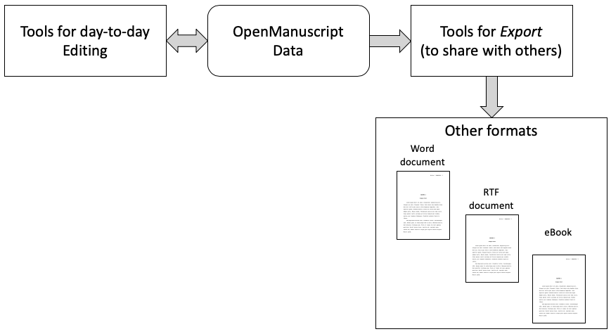

# OpenManuscript

This is OpenManuscript, a text-based data format specification for writing
fiction, and turning them into manuscripts.

For more information about this specification, contact david@dhrogers.com.

Project tweets at [@OpenMSProject](https://twitter.com/openmsproject)

## Introduction

This is a specification for OpenManuscript v1.0, a database for an ASCII text-based workflow for creating manuscripts. 

Using the OpenManuscript format separates the data from the applications used
to edit, display or print it, which is a very powerful mechanism for invention.
With this format, a writer can use a variety of tools instead of being locked
into using a specific one. This means that innovative developers can create new
tools over time, and writers can adopt these new tools without converting any
data to the new tool. The writer can create a workflow that best supports
a personal, intuitive and specific way of crafting novels. 

## The Overall Workflow for OpenManuscript

As shown in the above diagram, the OpenManuscript format is used by any
compliant editing tool in the day to day work, and when it's time to look at
a final manuscript, share it as a specific document type (Word, PDF, etc.) or
publish it as a final product (ebook, etc.), the writer uses another tool to
create that product, which is then used as appropriate.

The vision for this data format is to provide a text-based, flexible way of
capturing, organizing and promoting the sometimes chaotic progression of ideas
that go into making a novel. The OpenManuscript format is text-based, so it
isn't locked behind the firewall of a particular application. Rather, it is
a format that can be edited by simple tools, compiled into any format, and
returned to again and again over time. Using a text-based standard means
the author needn't worry that the format will be unreadable down the road
because the software you used outdated, no longer reads that version of the
output, or is simply gone. 

At the most basic level, a manuscript is a pairing of an author and a sequence
of chapters, and this is represented in the basic structure of the
OpenManuscript format. The format assumes you'll write lots of scenes, trying
them out in different sequences of chapters. It's easy to have different
arrangements of different scenes so that you can quickly compare them. Meta data tags throughout the specification capture additional data that can be included to enrich a properly formatted manuscript.

This repository includes a specification document, simple tools, and an example of the file format.

Keep it simple.

