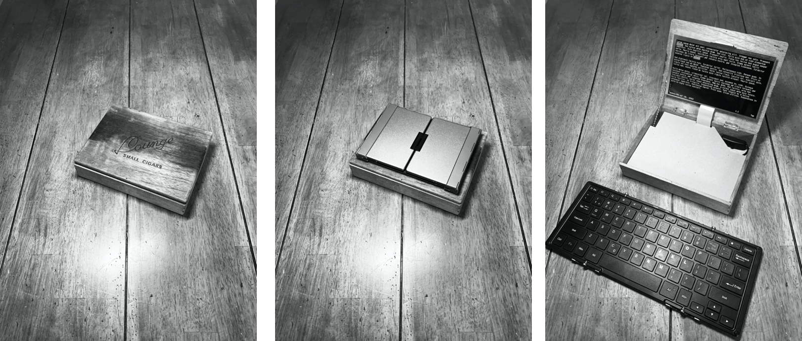

# RogueWriter: A do-it-yourself distraction-free writing device

It's a writer's dream. Or maybe it's just an obsession.

**RogueWriter** is a portable device that makes it easy to write, without all the distractions 
that a laptop can offer. There are a lot of different attempts at this, and for mine, I wanted something that:

- Was reliable, simple, and flexible
- Was portable, with good battery life
- Was reasonably cheap 
- Was cool, like a clacky, satisfying old typewriter 
- Supported a useful workflow

There are a lot of ways to overplan this, and you can waste a lot of time 3D
printing the perfect case, running wiring diagrams, and stuff like that. 
I didn't want to get lost in that. 
I wanted a design that was easy to build (no soldering or finicky construction). 
The perfect thing would be to buy a bunch of stuff to plugs together, and
ends up being cool. I wanted something I wouldn't be embarrassed to be seen 
using in your local coffee shop.

The design of this thing is important. You'll see that this drives some of 
the purchasing decisions.

So our project breaks into two parts: **1** Connecting some components together 
and **2)** fitting them into a case.

## The Guts

Let's lay this thing out and take a look at the guts. Once you have these things, you have a working computer. It's basically these components, for a total of about **$150**:

1. **Computer. ($14)** This design uses the **Raspberry Pi W**, a small, low-power computer
  that has both wifi and bluetooth on board. This particular design uses a **Pi W** with pre-soldered [header pins](https://www.adafruit.com/product/3708), so you can plug in the specified display.
	- You can buy a memory card with the [OS pre-installed](https://www.adafruit.com/product/3259), or you can [install it yourself](https://www.raspberrypi.org/downloads/noobs/).
- **Display. ($49)** The display is pretty important. I've seen a lot of designs for
  things like this using small displays, and they typically have cables and plus
  sticking out of them. 
    - I wanted something without a lot of messy cable connections, so I chose a [display that lays flat and has a ribbon connection](https://www.amazon.com/gp/product/B0716RVNTS/ref=ppx_yo_dt_b_search_asin_title?ie=UTF8&psc=1).
- **Keyboard. ($55)** Buyer's choice here. There are lots of options for bluetooth
  keyboards, and you can make your own choices on portability, feel, size, etc.
  I have two options that work well for me, and that reliably connect to the
  `pi` over bluetooth. 
    - Here's my current [favorite keyboard](https://www.amazon.com/gp/product/B019PIXO78/ref=ppx_yo_dt_b_search_asin_title?ie=UTF8&psc=1). This is one of the only keyboards that I've found 
      that maintains a connection with the `pi` through power cycles. It's a nice size, and the
      layout is great for touch typing. It holds a good charge, and turns on/off
      as the keyboard is opened/closed. Nice product.
- **Battery. ($18)** Your choice, based on price, battery life, form factor, etc. A lot of
  different batteries will work, and I always have an eye out for a smaller
  battery pack on sale. [Here's the one that I'm using now](https://www.amazon.com/POWERADD-Pilot-2GS-High-Speed-Smartphone/dp/B00N2JBTEM/ref=sr_1_1_sspa?keywords=poweradd%2B10000).
- [USB on/off switch](https://www.amazon.com/gp/product/B07CTHKXDW/ref=ppx_yo_dt_b_search_asin_title?ie=UTF8&psc=1). This keeps the battery from draining, even after you've shut down the `pi`.
- [USB right angle adapter](https://www.amazon.com/gp/product/B01C6031MA/ref=ppx_yo_dt_b_search_asin_title?ie=UTF8&psc=1) You may not need them, but for my arrangement of parts in the cigar box, I needed these. Take a look at how I use two of these, to provice access to the USB connector on the `pi` board, while still jamming it up against the battery.  
- USB micro cable.

## Other Parts

- A really cool cigar case. This is important, as it sets the parameters of the
  final device. Don't obsess too long about it, though, as you can always take
  these parts and put them into a new, cooler case. In fact, you might say that
  that's kind of the point of this whole thing.
- Double stick tape and velcro. This holds things together well enough to keep
  everything in place, but it can be repositioned if you need to change things. I ended up using 
  velcro to keep the battery in place, because it's the one thing you need the most access to.
- Small bit of lighting chain, and two screws to keep the lid in place. You
  may not need this, if your cigar box has some nifty hinges that stay open.
- Tools. All I needed was an x-acto knife to cut the double sided tape, and the cardboard cover.

## Assembly

It's important that you let go of making this some futzy, crazy, perfect thing.
Some tape and bubble gum keeping it together is a good thing. As long as you have a cool cigar box, this will look cool.

1. Assemble the guts of the device (computer, display, battery), and have a USB mouse and keyboard available to set everything up. The bluetooth keyboard needs to be paired by starting things up in 'normal' desktop mode.
2. Plug them together to make sure it all works. This includes installing the OS for the `pi`.
3. Find a nice way to fit everything into your case, and lightly double stick tape the components in place. This will take some trial and error, but since you're not soldering or gluing, it's pretty easy to fit things in. Once you have things settled in, you can velcro the battery in place, and more permanently tape everything in place.

## OS/Software

Next, you should [install the OS for your PI](http://someplace.html). Or, easier
still, you can buy a memory card that has the [OS
pre-installed.](http://someplace.html)

Now that you have a **RogueWriter** up and running, you have a choice. What workflow
do you want to support? The native OS for the `pi` is `Raspbian`, and it is
very flexible. You can easily:
    
- Use the computer as a normal Linux-based desktop, and use tools that work in
  that environment. This is great for most people, but it will require you to
  pair a mouse with the computer, as well. If that's what you want to do, that
  should work fine.
- Set up things to work in a terminal-only mode. If this option makes sense to
  you, you're closer to making a more distraction-free **RogueWriter**. 

