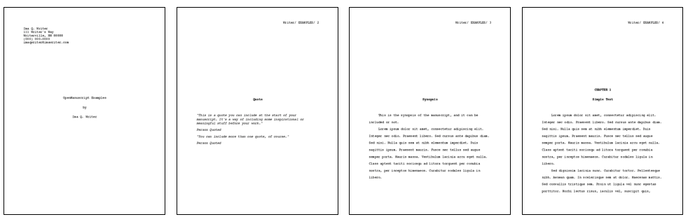

# OpenManuscript tools

This is a set of tools that support **OpenManuscript** workflows.

For more information about these tools, contact **david *at* dhrogers *dot*
com**.


## Requirements

Requirements for this toolset:

- **python 3.x**
- Modules as listed in the ``setup.py`` file. These will be installed
  automatically if ``pip`` setup is used, per instructions.


## Installation 

These tools installs in the normal python way. This will install the `openms`
python module, and the set of tools described below. To install, `cd` to the 
`tools/` directory and run:

```
pip3 install .
```

# Tools

---
## oms


*Example of manuscript pages generated by the oms tool*

This script outputs ``Word`` files (docx), as this is the industry standard 
for sharing manuscripts.

By default, the tool assumes it is being run in the manuscript directory. If
this is not the case, an explicit path must set on the command line.

### subcommands

- `edit` edit scene files
- `outline` create an outline from a manuscript
- `query` query operations on a manuscript


### command line arguments

- Input/Output
	- ``--authorfile`` the name of the author json file in the ``manuscriptdir``. Defaults to ``author.json``
	- ``--excludetags`` define a list of tags that are 'off', and are not included in any operation. Default is empty listy, and no tags are excluded.
	- ``--includetags`` define a list of tags that are 'on', and are included in any operation. Default is empty list, and all tags are included. 
	- ``--manuscriptdir`` the name of the directory containing the open manuscript data. Defaults to ``.``
	- ``--manuscriptfile`` the name of the manuscript file in the ``manuscriptdir``. Defaults to ``manuscript.json``
	- ``--manuscripttype`` type of manuscript to create. One of [novel, story]. Default: ``novel``
	- ``--outputfile`` write output to this file, in the ``manuscriptdir``. Defaults to ``manuscript.docx``
    - ``--settingsfile`` define a json file that defines values for command line arguments. This settings file is applied first, if present, and then 
      command line arguments can overwrite values.
    - ``--slug`` define a slug string that can be used by the current operation 
- Switches
	- ``--chapterdesc`` print a chapter description, if there is one, instead of the chapter.
	- ``--chaptersummary`` print a chapter summary, if there is one, instead of the chapter.
	- ``--excludesections`` if there are sections in scenes surrounded by arbitrary html tags, exclude those 
                            whose tags are listed in this arg. Note that sections must either by included or excluded, to prevent errors.
	- ``--includesections`` if there are sections in scenes surrounded by arbitrary html tags, include those 
                            whose tags are listed in this arg. Note that sections must either by included or excluded, to prevent errors.
	- ``--filescenesep`` print the scene filename, instead of the normal ``###`` between scenes.
	- ``--notes`` include **notes** content in each scene, if present.
	- ``--toc`` include a table of contents in the manuscript. 
- Formatting
	- ``--font`` define the font for the manuscript. Both ``Times`` and ``Courier`` are valid values.
	- ``--fontsize`` define the font size for the manuscript. Default is ``12``.
- Operations
	- ``--listscenes`` print a sorted list of the scenes defined by the other command line options 
    - ``--newmanuscript <dir>`` create a new manuscript template at the directory provided
	- ``--specversion`` report the version of ``OpenManuscript`` specification that this tool supports, then exit.
	- ``--types`` report the types of output files supported, then exit. 
	- ``--version`` report this application's version number, then exit.


### Examples

The `example` directory contains a sample **OpenManuscript** database for examples
and testing.

The following commands use the `example/` directory from this repository, and assume 
that you have installed the tool, per instructions above, and are starting from 
within the `tools/` directory. 

The following command uses all default settings, and will create a file named `manuscript.docx`. 
This is run within the `example` directory.

```
cd ../example
oms
```

This command shows how to use several command line options to override defaults.

```
cd ../example
oms --authorfile a.json --manuscriptfile m.json --outputfile m.docx
```

This command is run from the `tools` directory, and shows an example in which
`oms` runs using explicit paths. In this case, the `manuscript.docx` file will
be written in the `tools` directory.

```
oms --manuscriptdir ../example --authorfile a.json --manuscriptfile m.json
```

This command will create the `manuscript.docx` file at a specific
location, per the `--outputfile` argument. In this case, it will create the file
in the user's home directory.

```
oms --manuscriptdir ../example --authorfile a.json --manuscriptfile m.json --outputfile ~/example_manuscript.docx
```

Using the `settings` command line argument, the following command is equivalent to the one above, 
using a settings file named `draft.json`. Settings files can be useful for 
managing different kinds of output in the same project.

```
oms --settingsfile draft.json
```

Contents of draft.json:
```
{
    "manuscriptdir"  : "../example",
    "authorfile"     : "a.json",
    "manuscriptfile" : "m.json",
    "outputfile"     : "~/example_manuscript.docx"
}
```

Finally, the command line can be used to override or add arguments 
to those included in a settings file. The following command adds `--font`, and
overwrites the value of `--authorfile`, using the above `draft.json` file.

```
oms --settingsfile draft.json --font Courier --authorfile author.json
```

The subcommands are accessed in the normal way, from the command line. For example, to write the summary of the current (working) scene from a manuscript:

```
oms query --state current --manuscriptfile manuscript.json
```

To get the help for a specific subcommand:

```
oms query --help
```

### CSS files and the `oms outline` subcommand

The `oms outline` command creates an outline in a table in `html` format. The specifics of
the table can be controlled by a local `css` file, in the following way:

* Run the `oms outline` command

```
    oms outline --outputfile foo.html
```

* The command creates a `foo.html` file with the following `css` files linked
in:

```
<link rel="stylesheet"
    type="text/css"
    href="foo.css" />
<link rel="stylesheet"
    type="text/css"
    href="foo_override.css" />
```

* Default settings are contained in the `foo.css` written out by the command,
but the user may override those by creating a `foo_override.css` in the same
directory as the `foo.html`. Each column in the table can be selected through
the class selction method as in this example, which sets the width of the `TOD`
(time of day) column to 10%::

```
    th.tod { width: 10% }
```

### The \<include\> directive

This tool will include files one level deep. It looks in the `scenes` directory
for `filename` with the directive formatted this way:

```
<include>filename</include>
```


### Known issues

``oms`` uses several other libraries under the covers to write out ``docx``
files, and is limited by those tools. In particular, the current version of
``oms`` has the following limitations:

1. **Issue** Numbered lists do not reset. If you have numbered lists across chapters,
these chapters will share a single numbering system. A fix is in development in
the underling libraries, and we will utilize that fix when it is developed.

    - *Solution* Use bullet (unordered) lists whenever possible.

2. **Issue** Footnotes will appear at the end of a chapter, but not in the footer of the
pages. Footnotes also suffer from the same numbering issue as #1. It is assumed
that most fiction manuscripts will use the footnotes as reminders of ideas and
edits, and not part of a finished manuscript, so this is not a show stopper.

    - *Solution* Use footnotes as internal notes for edits and ideas, and not as
      part of a final manuscript.
